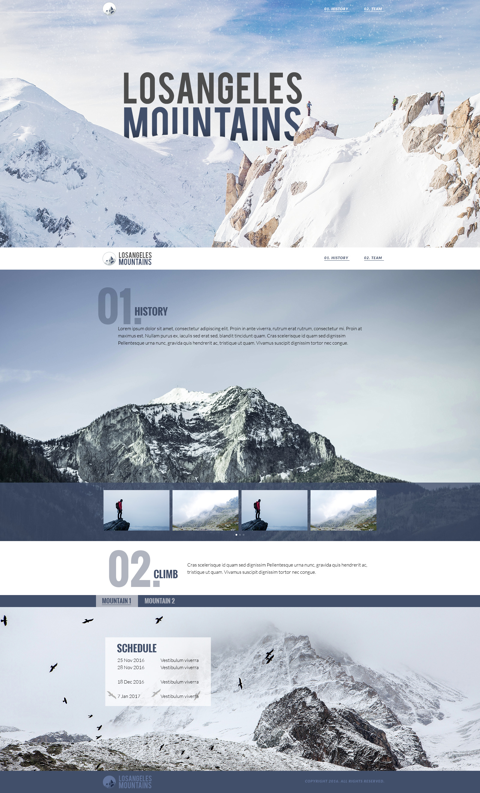

# Los Angeles Mountains

A great views of Los Angeles Mountains. Let's explore :)




-----

## Cloning the project 🪛🔨

```bash
# Clone this repository
$ git clone https://github.com/MastooraTurkmen/Task-Answer.git

# Go inside the repository 
$ cd Task-Answer
```

----


## Languages and Tools are used 🗣️🔧

1. **Languages** 🗣️

    + [HTML](https://github.com/topics/html)
    + [HTML5](https://github.com/topics/html5)
    + [CSS](https://github.com/topics/css)
    + [CSS3](https://github.com/topics/css3)

2. **Tools** 🔧

    + [Chrome](https://github.com/topics/chrome)
    + [VSCode](https://github.com/topics/vscode)
    + [Netlify](https://github.com/topics/netlify)


------


## Author 👩🏻‍💻

**Mastoora Turkmen**

[LinkedIn](https://www.linkedin.com/in/mastoora-turkmen/) 
<br>
[Github](https://github.com/MastooraTurkmen/) 
<br>
[Twitter](https://twitter.com/MastooraJ22)